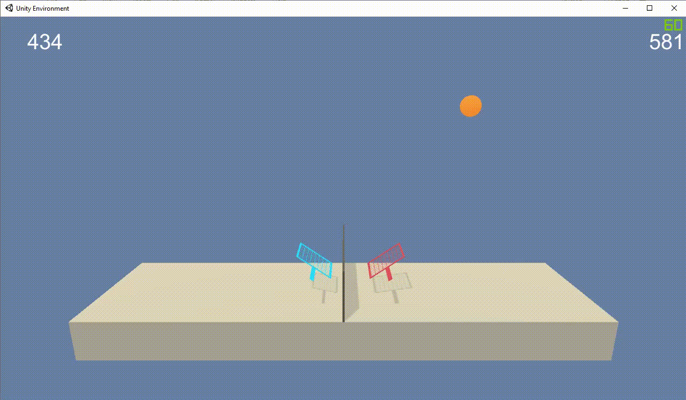

# Playing Tennis with Deep Reinforcement Learning




This project contains an agent based on **Deep Reinforcement Learning** that can learn from zero (no labeled data) to play Tennis. \o/

It's use the [Unity Machine Learning Agents Toolkit](https://github.com/Unity-Technologies/ml-agents) to design, train, and evaluate deep reinforcement learning algorithms implementations.

The environment used for this project is the Udacity version of the [Tennis Environment](https://github.com/Unity-Technologies/ml-agents/blob/master/docs/Learning-Environment-Examples.md#tennis), from [Unity](https://unity3d.com/pt/machine-learning).

We have two versions for this Unity environment:

This project is part of my [Deep Reinforcement Learning Nanodegree](https://www.udacity.com/course/deep-reinforcement-learning-nanodegree--nd893).

## Environment details

In this environment, two agents control rackets to bounce a ball over a net.

### Reward

If an agent hits the ball over the net, it receives a reward of `+0.1`. If an agent lets a ball hit the ground or hits the ball out of bounds, it receives a reward of `-0.01`. Thus, the goal of each agent is to keep the ball in play.

### State and Action spaces

The observation **space** consists of `8` variables corresponding to the position and velocity of the ball and racket. Each agent receives its own, local observation.

Two continuous **actions** are available, corresponding to movement toward (or away from) the net, and jumping.

### Solving the Environment

The task is episodic, and in order to solve the environment, your agents must get an average score of `+0.5` (over 100 consecutive episodes, after taking the maximum over both agents). Specifically,

- After each episode, we add up the rewards that each agent received (without discounting), to get a score for each agent. This yields 2 (potentially different) scores. We then take the maximum of these 2 scores.
- This yields a single **score** for each episode.

The environment is considered solved, when the average (over 100 episodes) of those **scores** is at least `+0.5`.

---

## Installation

The installation process is divided in three parts:

1. Python 3.6.x
2. Dependencies
3. Unity's Environment


This notebook was developed on AWS SageMaker.

The kernel used is **conda_python3**


### Python

To install and run this project you will need to have Python 3.6.x.

You could download olds Anaconda versions [here](https://repo.anaconda.com/archive/)

The reason for it is that Unity ml-agents needs TensorFlow in version 1.15 and TensorFlow 1.15 needs Python. 3.6.x.

The best way to run this project is on [AWS SageMaker](https://aws.amazon.com/pt/sagemaker/).

### Dependencies 

All packages and their versions are describe in [requirements.txt](requirements.txt).

You need to run these commands before to install all dependencies:

```
pip install --upgrade pip
pip install -r requirements.txt
pip -q install ./python
```

You'll have these three commands in the first part of [Continuous_Control.ipynb], as well.

### Unity's Environment

As you know, we have two different environment versions for this project. Select what you want.

The environment for **Linux** and **Windows (64-bit)** is already in that repository.

Download the environment from one of the links below.  You need only select the environment that matches your operating system:

 - Linux: [click here](https://s3-us-west-1.amazonaws.com/udacity-drlnd/P3/Tennis/Tennis_Linux.zip)
 - Mac OSX: [click here](https://s3-us-west-1.amazonaws.com/udacity-drlnd/P3/Tennis/Tennis.app.zip)
 - Windows (32-bit): [click here](https://s3-us-west-1.amazonaws.com/udacity-drlnd/P3/Tennis/Tennis_Windows_x86.zip)
 - Windows (64-bit): [click here](https://s3-us-west-1.amazonaws.com/udacity-drlnd/P3/Tennis/Tennis_Windows_x86_64.zip)

(_For Windows users_) Check out [this link](https://support.microsoft.com/en-us/help/827218/how-to-determine-whether-a-computer-is-running-a-32-bit-version-or-64) if you need help with determining if your computer is running a 32-bit version or 64-bit version of the Windows operating system.

(_For AWS_) If you'd like to train the agent on AWS (and have not [enabled a virtual screen](https://github.com/Unity-Technologies/ml-agents/blob/master/docs/Training-on-Amazon-Web-Service.md)), then please use [this link](https://s3-us-west-1.amazonaws.com/udacity-drlnd/P2/Reacher/one_agent/Reacher_Linux_NoVis.zip) (version 1) or [this link](https://s3-us-west-1.amazonaws.com/udacity-drlnd/P2/Reacher/Reacher_Linux_NoVis.zip) (version 2) to obtain the "headless" version of the environment.  You will **not** be able to watch the agent without enabling a virtual screen, but you will be able to train the agent.  (_To watch the agent, you should follow the instructions to [enable a virtual screen](https://github.com/Unity-Technologies/ml-agents/blob/master/docs/Training-on-Amazon-Web-Service.md), and then download the environment for the **Linux** operating system above._)
    
Then, place the unzipped folder on the root of this repository.

---

## License

The contents of this repository are covered under the MIT [License](LICENSE).